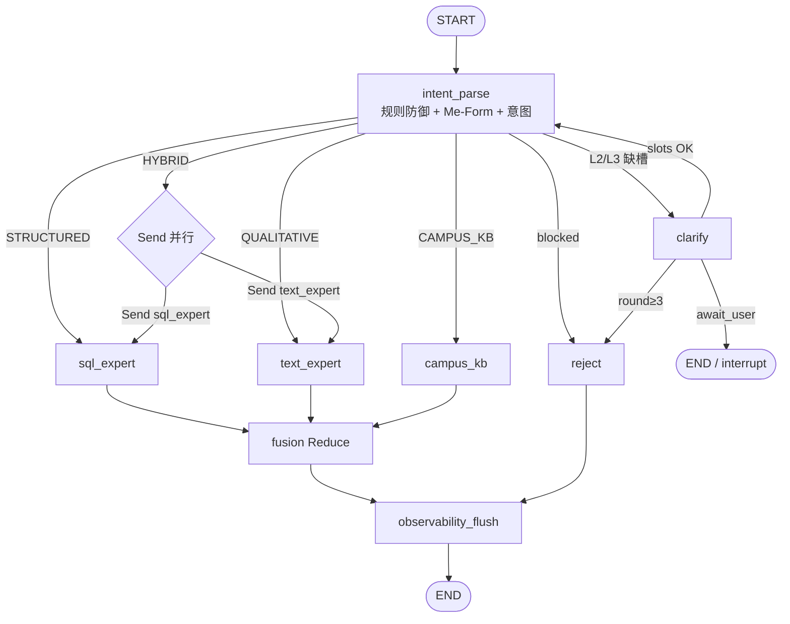
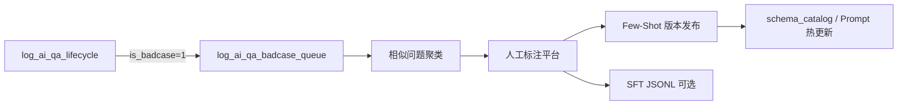

# AI+校务质量监测多 Agent 智能小助手 — 系统架构设计文档

| 属性 | 说明 |
|------|------|
| 文档版本 | v2.0（合并 v1.0 基础架构 + v1.1 生产级扩展） |
| 技术栈 | Python 3.11+、LangGraph ≥0.3、Pydantic ≥2.0、LangChain Core |
| 系统基准时间 | 2026 年 5 月 |
| 关联代码 | `edu_quality_agent/` |
| 关联 DDL | `jy_course_he.sql`、`jy_application_tqmp.sql` |

---

## 目录

1. [概述](#1-概述)
2. [业务背景与用户画像](#2-业务背景与用户画像)
3. [核心痛点与设计原则](#3-核心痛点与设计原则)
4. [总体架构](#4-总体架构)
5. [全局多 Agent 协同拓扑](#5-全局多-agent-协同拓扑)
6. [全局状态 AgentState](#6-全局状态-agentstate)
7. [节点 1：网关解析、Me-Form 与绝对防御](#7-节点-1网关解析me-form-与绝对防御)
8. [数仓架构与 Schema RAG](#8-数仓架构与-schema-rag)
9. [SQL 子图与安全 Guardrails](#9-sql-子图与安全-guardrails)
10. [并行多 Agent 协作（HYBRID）](#10-并行多-agent-协作hybrid)
11. [用户身份感知（Me-Form）](#11-用户身份感知me-form)
12. [数据飞轮与可观测性](#12-数据飞轮与可观测性)
13. [企业级扩展能力](#13-企业级扩展能力)
14. [代码工程结构](#14-代码工程结构)
15. [端到端场景示例](#15-端到端场景示例)
16. [实施分期与验收指标](#16-实施分期与验收指标)
17. [工期安排表（详细版）](#17-工期安排表详细版)
18. [附录](#18-附录)

---

## 1. 概述

本系统面向高校**教学质量督导**与**校/院领导**，在 Python 生态下基于 **LangGraph 状态机**实现多 Agent 协同的智能问答助手。系统需同时应对：

- **极其复杂的业务数仓**（数百张 ODS 表、晦涩字段与多表 JOIN）；
- **大量非结构化评教文本**（学生评语、督导建议）；
- **口语化、含糊不清的用户提问**；
- **身份相关的「我/本院」类问题**；
- **跨结构化指标与质性文本的复合问题**；
- **生产级安全、可观测与持续进化（数据飞轮）**。

**核心设计范式**：不让 LLM 直接面对全量 DDL，而是通过 **语义数仓层 + Schema RAG 裁剪 + 多 Agent 分工 + 并行汇合 + 全链路埋点** 实现可落地的生产架构。

---

## 2. 业务背景与用户画像

### 2.1 服务对象

| 角色 | 典型诉求 | 查询特征 |
|------|----------|----------|
| **教学质量督导** | 特定教师/周期出勤率、抬头率变化；评教雷达图；督导 vs 学生评分差异 >15% 的异常课；文字改进建议 | 高频、专业、细粒度 |
| **院领导** | 本院思政课均分；本院排名与滑坡风险；重点关注课程/教师 | 中观、带「我们学院」 |
| **校领导** | 全校思政课大盘；各学院年度质量排名；表彰候选；全校预警 | 宏观、跨学院 |

### 2.2 现有数据源（ODS）

| 库名 | 规模 | 主要内容 |
|------|------|----------|
| `jy_course_he` | ~60 张表 | 学年学期、排课、教师、学生、科目、教室、组织等 |
| `jy_application_tqmp` | ~145 张表 | 期末评教、督导评价、同行评价、领导评价、抽课任务等 |

**关键 ODS 表示例**：

- 课表/时间：`t_schedule`、`t_lesson_time`、`t_academic_term`
- 人员/组织：`t_teacher`、`t_user`、`t_organization`、`t_subject`
- 期末评教：`t_end_term_record`、`t_end_term_record_survey`
- 督导评教：`t_sup_course_record`、`t_sup_record_survey`、`t_sup_record_photo_review`
- 课堂行为（抬头率/出勤率）：多来自 **TIAS/录播分析** 外部同步，ODS 中仅有少量关联字段

---

## 3. 核心痛点与设计原则

### 3.1 核心痛点

| # | 痛点 | 风险 |
|---|------|------|
| 1 | 数百张表、关联复杂，直接 Text-to-SQL | Context 爆炸、严重幻觉 |
| 2 | 评教评语、督导建议等非结构化文本 | 纯 SQL 无法回答「综合印象」 |
| 3 | 「看下孙老师的数据」类口语 | 指标/时间/实体歧义 |
| 4 | 无关问题、SQL 注入、薪资等敏感信息 | 安全与合规 |
| 5 | 「我下周听课任务」「我们学院均分」 | 必须结合登录身份解析 |
| 6 | 既要趋势又要评语 | 串行慢、需跨域联查 |
| 7 | 无法沉淀 Badcase | 系统难以持续进化 |

### 3.2 设计原则

| 原则 | 实现方式 |
|------|----------|
| LLM 不直面全库 | `edu_ai_dw` 语义层 + Schema RAG 裁剪 ~5% DDL |
| 结构化 / 质性分流 | SQL 专家 vs Text 专家；`HYBRID` 时并行 |
| 口语 → 可执行槽位 | 网关多级追问 + Me-Form 物理 ID |
| 安全默认拒绝 | 规则引擎先于 LLM；SQL 静态审计；只读从库 |
| 身份不可扩权 | `user_profile` 由网关注入，Agent 不得扩大 scope |
| 可观测、可熔断 | 全链路 `trace_id`；`max_*` 流控；Badcase 飞轮 |

---

## 4. 总体架构

```
┌─────────────────────────────────────────────────────────────────────────┐
│                         前端 / 移动端 / 钉钉                             │
└─────────────────────────────────┬───────────────────────────────────────┘
                                  │ HTTPS + JWT
┌─────────────────────────────────▼───────────────────────────────────────┐
│  API 网关（FastAPI）                                                      │
│  · Session → UserProfile 注入                                            │
│  · trace_id 生成 · 限流 · 审计                                           │
└─────────────────────────────────┬───────────────────────────────────────┘
                                  │
┌─────────────────────────────────▼───────────────────────────────────────┐
│  LangGraph 编排层（edu_quality_agent/graph.py）                           │
│  intent_parse → [parallel: sql_expert | text_expert] → fusion → flush    │
└───┬─────────────────┬─────────────────────┬─────────────────────────────┘
    │                 │                     │
    ▼                 ▼                     ▼
┌─────────┐   ┌───────────────┐   ┌─────────────────┐
│ LLM 服务 │   │ Schema RAG    │   │ 向量库 / 文本标签 │
│         │   │ (Milvus/pgvec) │   │ text_survey_*   │
└─────────┘   └───────┬───────┘   └─────────────────┘
                      │
        ┌─────────────┴─────────────┐
        ▼                           ▼
┌───────────────┐           ┌───────────────────┐
│ edu_ai_dw     │           │ jy_course_he      │
│ 语义层/视图    │           │ jy_application_tqmp│
│ (AI 友好)     │           │ (ODS 只读从库)     │
└───────────────┘           └───────────────────┘
        │
        ▼
┌───────────────────────────────────────┐
│ log_ai_qa_lifecycle · badcase_queue   │
│ → 离线聚类 · Few-Shot · 可选 SFT       │
└───────────────────────────────────────┘
```

---

## 5. 全局多 Agent 协同拓扑

### 5.1 节点职责一览

| 节点 ID | Agent 角色 | 职责 |
|---------|-----------|------|
| `intent_parse` | 网关 + Me-Form + 意图 | 规则防御、代词解析、意图分类、槽位、判定 HYBRID |
| `clarify` | 澄清助手 | L1~L3 追问；`interrupt` 等待用户 |
| `schema_rag` | Schema 路由 | 指标词典 + 混合检索，裁剪 5~8 张表（内嵌于 sql_expert） |
| `sql_expert` | **Agent_A** SQL 专家 | Schema RAG → 生成 → 审计 → 执行 → `sql_result` |
| `text_expert` | **Agent_B** Text 专家 | 向量检索 → 主题/情感 → `text_result` |
| `campus_kb` | 校务知识 | 制度/流程 RAG，与业务库隔离 |
| `fusion` | **Reduce 汇合** | 多源融合 + 交叉验证 |
| `observability_flush` | 埋点刷盘 | 写 `log_ai_qa_lifecycle`、Badcase 入队 |
| `reject` | 拒答 | 统一安全话术 |

### 5.2 完整流转拓扑（含并行）



### 5.3 纠错与熔断循环

| 循环类型 | 路径 | 上限 |
|----------|------|------|
| SQL 纠错 | `sql_audit` 失败 → 重新 `sql_generate` | `max_sql_retries = 3` |
| 澄清循环 | `clarify` → 用户回复 → `intent_parse` | `max_clarification_rounds = 3` |
| 全局熔断 | 任意节点 `total_loop_count` | `max_total_loops = 15` |

### 5.4 LangGraph 并行语法（Send API）

**Fan-out**（`intent_parse` 对 `HYBRID`）：

```python
from langgraph.types import Send

def fan_out_parallel(state: AgentState) -> Sequence[Send]:
    return [
        Send("sql_expert", state.model_dump()),
        Send("text_expert", state.model_dump()),
    ]
```

**Fan-in**：`sql_expert`、`text_expert` 均 `add_edge(..., "fusion")`，两路完成后进入汇合。

**单路降级**：`STRUCTURED` 仅 `sql_expert → fusion`；`QUALITATIVE` 仅 `text_expert → fusion`。

推荐编译入口：`build_graph_with_send()` → `compile_app()`（见 `edu_quality_agent/graph.py`）。

---

## 6. 全局状态 AgentState

### 6.1 状态传递链

```
user_profile (Session 注入)
  → intent_parse → rewritten_query, resolved_filters, intent, parallel_branches
  → sql_expert / text_expert → sql_result, text_result
  → fusion → final_answer, cross_validation_warnings
  → observability_flush → lifecycle_log → DB
```

### 6.2 核心字段分组

| 分组 | 字段 | 说明 |
|------|------|------|
| 会话 | `thread_id`, `trace_id`, `messages` | 多轮与全链路追踪 |
| 身份 | `user_profile` | `UserProfile`：角色、学院、org_scope |
| 输入 | `raw_query`, `rewritten_query` | 原始 vs Me-Form 重写 |
| 意图 | `intent`, `slots`, `clarification_level` | 分类与追问 |
| Me-Form | `resolved_filters` | 物理 ID 过滤条件 |
| 并行 | `enable_parallel`, `parallel_branches`, `branches_completed` | 分支控制 |
| 结果 | `sql_result`, `text_result` | `SqlBranchResult` / `TextBranchResult` |
| Schema | `selected_schema_bundle`, `source_tables` | SQL 分支上下文 |
| 输出 | `final_answer`, `cross_validation_warnings` | 融合产物 |
| 流控 | `total_loop_count`, `sql_retry_count`, `max_*` | 熔断 |
| 埋点 | `lifecycle_log` | `QaLifecycleLog` 快照 |

完整定义见：`edu_quality_agent/state.py`。

### 6.3 UserProfile 结构

```python
class UserProfile(BaseModel):
    user_id: str
    display_name: str
    role: UserRole  # supervisor | college_leader | school_leader
    tenant_id: str
    college_id: Optional[int]
    org_scope_ids: list[int]       # 行级权限，后端 RBAC 已算好
    supervised_teacher_ids: list[int]
    watched_course_ids: list[int]
    baseline_date: str = "2026-05-20"
```

---

## 7. 节点 1：网关解析、Me-Form 与绝对防御

### 7.1 意图分类矩阵

| 主意图 | 判定信号 | 路由 |
|--------|----------|------|
| `structured_data` | 均分、排名、趋势、抬头率、异常、雷达图 | `sql_expert` |
| `qualitative_text` | 评语、建议、印象、主题、情感 | `text_expert` |
| `hybrid` | 同时含数值指标 + 文字评语类关键词 | **Send 并行** |
| `campus_knowledge` | 制度、流程、如何操作 | `campus_kb` |
| `blocked` | 天气、闲聊、注入、薪资/身份证 | `reject` |

### 7.2 三层防御

```
Layer-0 规则（<5ms）：正则 + 敏感词 + 租户策略
Layer-1 LLM 结构化输出：intent, confidence, slots
Layer-2 置信度：confidence < 0.6 → 降级 clarify
```

**拒绝示例**：`DROP TABLE`、非教学域闲聊、薪资刺探、未登录 Session。

### 7.3 启发式多级澄清

| 等级 | 条件 | 行为 |
|------|------|------|
| **L0** | 教师 ID + 学期 + 指标明确 | 直接执行 |
| **L1** | 仅缺非关键项（如未写学期） | 默认值执行 + 答复声明假设 |
| **L2** | 缺教师消歧 / 缺指标 | **必须追问**，`interrupt_before=['clarify']` |
| **L3** | 「异常学生」等歧义实体 | 追问 + 选项列表 |

### 7.4 追问提示词策略

```text
你是高校教学质量监测系统的澄清助手。
当前用户角色：{user_role}。基准日期：{baseline_date}。

用户原问题：{raw_query}
已识别槽位：{slots_json}
缺失或模糊项：{missing_slots}

请生成 1~3 个封闭式追问：
1. 每条只解决一个槽位，提供可选项（学期/指标/学院）。
2. 同名教师必须要求工号或学院，禁止猜测。
3. 未指定学期时默认「当前学期」（由 baseline_date 计算 acte_id）。
4. 督导用户优先追问「指标」；校领导优先追问「范围」与「时间粒度」。
5. 语气专业简洁，不暴露系统内部架构。

输出 JSON：{"questions": [...], "suggested_defaults": {...}}
```

### 7.5 口语样例映射

| 用户输入 | 抽取/行为 |
|----------|-----------|
| 「看下孙老师的数据」 | `teacher_name` → L2 追问工号/学院、指标；L1 默认当前学期 |
| 「查异常学生」 | L3：评教异常 / 出勤异常 / 学风违纪？ |
| 「思政课大盘」 | `subject_category=思政`；校领导默认全校 |
| 「我下周有哪些听课任务」 | Me-Form → `include_self_tasks` + `sup_user_id` |

---

## 8. 数仓架构与 Schema RAG

### 8.1 设计目标

在 ODS 之上建设 **`edu_ai_dw` 语义层**，对 LLM 暴露「指标 + 视图 + 有限列 DDL」，而非数百张 `t_*` 原表。

### 8.2 星型模型（逆推业务诉求）

#### 维度表（Dim）

| 逻辑表 | ODS 来源 | 用途 |
|--------|----------|------|
| `dim_date` | `t_academic_year`, `t_academic_term` | 学期、同比环比 |
| `dim_teacher` | `t_teacher`, `t_user` | 教师分析、表彰 |
| `dim_org` | `t_organization` | 学院排名、滑坡 |
| `dim_subject` | `t_subject`, `t_subject_category`, `t_subject_nature` | **思政类**筛选 |
| `dim_teaching_class` | `t_teaching_class` | 教学班粒度 |
| `dim_lesson_session` | `t_schedule`, `t_lesson_time`, `t_course` | 节次、教室 |
| `dim_evaluation_task` | `t_sup_task`, `t_end_term_task` | 评教任务上下文 |

#### 事实表（Fact）

| 逻辑表 | ODS 来源 | 核心度量 |
|--------|----------|----------|
| `fact_end_term_score` | `t_end_term_record`, `t_end_term_record_survey` | 学生均分、参评率、雷达维度 |
| `fact_supervision_lesson` | `t_sup_course_record`, survey | 督导得分、听课次数 |
| `fact_peer_evaluation` | 同行评价记录族 | 同行均分 |
| `fact_leader_evaluation` | 领导评价记录族 | 领导评分 |
| `fact_lesson_behavior` | TIAS/外部同步 | `attendance_rate`, `head_up_rate` |
| `fact_evaluation_anomaly` | 预计算视图 | `sup_stu_gap_pct`, `is_anomaly` |

#### 文本标签表（Text）

| 表 | 内容 | 检索 |
|----|------|------|
| `text_survey_comment` | 期末开放题、意见题 | 向量 + 元数据过滤 |
| `text_sup_suggestion` | `t_sup_record_photo_review.review_content` 等 | 同上 |
| `text_comment_tags` | 离线 LLM 打标：表扬/板书/互动等 | 结构化 + 语义 |

#### 核心预计算视图

```sql
CREATE VIEW edu_ai_dw.vw_teacher_term_quality AS
SELECT
  t.teacher_sk,
  t.teacher_name,
  d.acte_name,
  AVG(fes.stu_score) AS stu_avg,
  AVG(fsl.sup_score) AS sup_avg,
  ABS(AVG(fsl.sup_score) - AVG(fes.stu_score))
    / NULLIF(AVG(fes.stu_score), 0) AS sup_stu_gap_pct,
  AVG(flb.attendance_rate) AS attendance_rate,
  AVG(flb.head_up_rate) AS head_up_rate
FROM dim_teacher t
JOIN fact_end_term_score fes ON ...
JOIN fact_supervision_lesson fsl ON ...
LEFT JOIN fact_lesson_behavior flb ON ...
GROUP BY 1, 2, 3;
```

**异常规则示例**：`sup_stu_gap_pct > 0.15` → 督导与学生评教差异超 15%。

### 8.3 Schema RAG：Context Pruning（~5% DDL）

#### 离线：`schema_catalog`

每张表一条主文档（YAML/JSON）：

```yaml
table: t_sup_course_record
domain: [supervision, lesson]
aliases: [督导评教, 听课记录]
joins:
  - {to: t_subject, on: subj_id}
  - {to: t_academic_term, on: acte_id}
metrics: [sup_score, sup_stu_gap_pct]
sensitive_columns: [by_sup_user_id]
ddl_excerpt: |
  -- 仅 AI 可见列，非全量 DDL
```

#### 在线裁剪流水线

```
1. 指标词典匹配 → 确定 fact/dim 主题域
2. 混合检索：BM25(表名/注释/别名) + 向量(semantic_query) → top-8
3. 外键图谱 1-hop 扩展 → 补全 JOIN 维表
4. 权限裁剪 → 剔除无 org_scope 的表/列
5. 组装 schema_bundle：DDL excerpt + Few-shot SQL + 指标口径
```

**与节点 1 衔接**：`resolved_filters` + `metric_codes` 作为检索过滤条件。

---

## 9. SQL 子图与安全 Guardrails

### 9.1 SQL 子图内部流程

```
schema_rag → sql_generate → sql_audit → sql_execute → sql_result
                ↑_______________|（审计失败且 retry < max）
```

### 9.2 安全策略

| 层级 | 措施 |
|------|------|
| 生成约束 | Prompt 仅允许 `SELECT`；表白名单 `edu_ai_dw.*` |
| 静态审计 | **sqlglot**：拒绝 DML/DDL；禁止多语句 |
| LIMIT 注入 | AST 层：无 `LIMIT` → `LIMIT 200`；有则 `min(n, 500)` |
| 租户隔离 | 强制 `tenant_id = :tenant_id` |
| 行级权限 | `college_id IN (:org_scope_ids)` |
| 执行 | 只读账号、30s 超时、结果脱敏 |
| 参数化 | **禁止**将用户原文拼入 SQL |

### 9.3 LIMIT 注入示例

```python
def enforce_limit(sql: str, default_limit: int = 200) -> str:
    # 生产使用 sqlglot 在 AST 层注入
    if not re.search(r"\bLIMIT\b", sql, re.I):
        return f"{sql.rstrip().rstrip(';')}\nLIMIT {default_limit}"
    return sql
```

### 9.4 流控参数

| 参数 | 默认值 |
|------|--------|
| `max_clarification_rounds` | 3 |
| `max_sql_retries` | 3 |
| `max_total_loops` | 15 |
| `max_schema_tables` | 8 |

---

## 10. 并行多 Agent 协作（HYBRID）

### 10.1 触发条件

`intent_parse` 检测到**同时**需要：

- **结构化**：抬头率、出勤、均分、排名、趋势、异常……
- **质性**：评语、建议、印象、反馈、主题……

则：`intent = HYBRID`，`enable_parallel = True`，`parallel_branches = [sql, text]`。

### 10.2 复合问题示例

**用户**：「既要看孙老师这学期的抬头率趋势，又要看学生对他的主观文字评语综合印象」

```
intent_parse
  → HYBRID
  → Send(sql_expert) + Send(text_expert)  【并行】
sql_expert → sql_result（时序 rows）
text_expert → text_result（snippets + summary + themes）
  → fusion
  → 交叉验证 → final_answer
  → observability_flush
```

### 10.3 Fusion（Reduce）汇合逻辑

| 步骤 | 说明 |
|------|------|
| 等待分支 | 所有 `parallel_branches` 完成 |
| 结构化摘要 | 行数、耗时、趋势描述 |
| 质性摘要 | `text.summary`、`text.themes` |
| 交叉验证 | 例：趋势下行 + 负面文本 → 一致告警；文本正面但抬头率降 → 提示勿单维误判 |
| 角色话术 | 督导偏诊断；校领导偏宏观 |

---

## 11. 用户身份感知（Me-Form）

### 11.1 Session 注入（图外，API 层）

```
JWT / Session → UserProfile
  · user_id, role, tenant_id
  · college_id, org_scope_ids（RBAC 已算好，Agent 不可扩权）
  · watched_course_ids, supervised_teacher_ids
```

### 11.2 Me-Form 解析流程（`me_form.py`）

```
raw_query
  → resolve_me_form(query, user_profile)
       ├─ rewritten_query（供 LLM）
       └─ resolved_filters（供 SQL 参数化）
  → filters_to_sql_params() → :tenant_id, :org_scope_ids, ...
```

### 11.3 代词映射表

| 口语 | 解析 | 权限约束 |
|------|------|----------|
| 我 / 我的 | `sup_user_id = user_id` 等 | 仅本人任务/数据 |
| 我们学院 / 本院 | `college_id = profile.college_id` | `can_access_college()` |
| 全校 | 校领导：不限制；其他：`org_scope_ids` | **禁止越权** |
| 我关注的 | `course_ids = watched_course_ids` | 空则澄清 |
| 我下周听课 | `include_self_tasks=True` | 督导角色 |

### 11.4 安全重写示例

| 输入 | 院领导 college_id=201 |
|------|------------------------|
| 原句 | 「我们学院思政课平均分」 |
| rewritten | `学院[ID=201]思政课平均分` |
| filters | `{college_id: 201, metric_codes: ["stu_avg_score"], ...}` |
| SQL 参数 | `WHERE college_id = :college_id AND college_id IN (:org_scope_ids)` |

---

## 12. 数据飞轮与可观测性

### 12.1 埋点模块

代码：`edu_quality_agent/observability.py`

| 函数 | 职责 |
|------|------|
| `build_lifecycle_from_state()` | 从 `AgentState` 构建 `QaLifecycleLog` |
| `flush_lifecycle()` | 写入 DB / Kafka |
| `enqueue_badcase_pipeline()` | 异步入 Badcase 队列 |
| `record_user_feedback()` | 处理点赞/点踩/改写 |

### 12.2 问答流水表 `log_ai_qa_lifecycle`

DDL：`edu_quality_agent/sql/log_ai_qa_lifecycle.sql`

**字段分组**：

| 分组 | 关键字段 | 用途 |
|------|----------|------|
| 追踪 | `trace_id`, `thread_id` | 全链路 |
| 用户 | `user_id`, `user_role`, `org_scope_ids` | 权限复盘 |
| 提问 | `raw_query`, `rewritten_query`, `resolved_filters_json` | Me-Form |
| SQL | `generated_sql`, `sql_error`, `sql_error_code`, `sql_audit_errors` | **定位写错 SQL** |
| 性能 | `db_execution_ms`, `sql_retry_count`, `total_latency_ms` | 优化 |
| 并行 | `parallel_branches`, `text_summary`, `text_themes` | 分支产物 |
| 反馈 | `user_feedback`, `is_badcase`, `badcase_reason` | 飞轮 |

### 12.3 Badcase 自动判定

| 触发条件 | `badcase_reason` |
|----------|------------------|
| `sql_retry_count >= max_sql_retries` | `sql_retry_exhausted` |
| `total_loop_count` 熔断 | `loop_exhausted` |
| 用户点踩 | `user_thumbs_down` |

### 12.4 离线飞轮流水线



| 批次 | 动作 |
|------|------|
| 日批 | 按 `intent + sql_error` 聚类 Top-N |
| 周批 | 高赞 → 正样本 Few-Shot；点踩 → 负样本 |
| 指标 | SQL 一次通过率、点踩率、P95 `db_execution_ms` |

---

## 13. 企业级扩展能力

### 13.1 冷热数据隔离（抬头率时序）

| 层级 | 策略 |
|------|------|
| **热** | 近 2 学期明细 `fact_lesson_behavior_hot`（按 `acte_id` 分区） |
| **温** | 学年/周聚合 `agg_teacher_term_behavior` |
| **冷** | 历史归档 ClickHouse / OSS；多年对比走异步 OLAP Job |
| **Agent** | 指标词典标注 `granularity`；`intent_parse` 自动降采样 |

### 13.2 Text-to-Chart

- `fusion` 输出 `chart_spec`（Vega-Lite / ECharts JSON）
- 时序 → 折线；学院对比 → 柱状；评教 → 雷达图
- 由 `chart_planner` 基于 `sql_result.rows` 生成，**禁止** LLM 凭空造数
- 埋点记录 `chart_type` 与 `trace_id` 绑定

### 13.3 多轮对话上下文继承与净化

| 问题 | 方案 |
|------|------|
| 上下文膨胀 | 仅保留近 3 轮 + `resolved_filters` 持久化在 Checkpointer |
| 指代消解 | 「那他呢」绑定上一轮 `teacher_user_id` |
| 权限漂移 | 每轮重新校验 `user_profile` |
| 净化 | `context_sanitizer` 剥离历史 SQL，仅保留 `slots` JSON |

---

## 14. 代码工程结构

```
edu_quality_agent/
├── __init__.py              # 对外导出 compile_app, AgentState, UserProfile
├── state.py                 # AgentState, UserProfile, 分支结果, QaLifecycleLog
├── me_form.py               # Me-Form 解析与 SQL 参数
├── observability.py         # 埋点刷盘与 Badcase 入队
├── graph.py                 # LangGraph 构图、Send 并行、节点 Stub
└── sql/
    └── log_ai_qa_lifecycle.sql

docs/
└── AI校务质量监测多Agent系统架构设计.md   # 本文档

jy_course_he.sql             # ODS：课表/组织
jy_application_tqmp.sql      # ODS：评教/督导
```

### 14.1 依赖建议

```
langgraph>=0.3
langchain-core>=0.3
pydantic>=2.0
sqlglot>=25.0
```

### 14.2 调用示例

```python
from edu_quality_agent import compile_app, AgentState, UserProfile, UserRole

app = compile_app(checkpointer=postgres_saver)

state = AgentState(
    thread_id="sess-001",
    raw_query="既要看孙老师这学期抬头率趋势，又要看学生对他的文字评语印象",
    user_profile=UserProfile(
        user_id="U10086",
        role=UserRole.SUPERVISOR,
        tenant_id="T001",
        college_id=201,
        org_scope_ids=[201],
    ),
)

result = await app.ainvoke(
    state.model_dump(),
    config={"configurable": {"thread_id": "sess-001"}},
)
```

---

## 15. 端到端场景示例

### 15.1 督导：评教差异异常课

**提问**：「2025-2026 第二学期孙丽华老师，督导和学生评教差超过 15% 的课有哪些？」

```
intent_parse → STRUCTURED
→ schema_rag → vw_teacher_term_quality, t_sup_course_record
→ sql_expert → WHERE sup_stu_gap_pct > 0.15
→ fusion → 列表 + 听课建议
→ observability_flush
```

### 15.2 校领导：思政课大盘与滑坡

**提问**：「本学年全校思政类课程学生评教排名，标注连续两学期下滑的学院」

```
intent_parse → STRUCTURED（校领导 scope）
→ schema_rag → dim_subject(思政), fact_end_term_score, dim_org
→ sql_expert → 聚合 + 窗口函数环比
→ analyst 规则 → fusion 宏观表述
```

### 15.3 院领导：Me-Form + 本院

**提问**：「我们学院这学期思政课平均分是多少？」

```
Me-Form → college_id=201, rewritten_query
→ sql_expert → 参数化查询
→ fusion
```

### 15.4 督导：个人任务

**提问**：「我下周有哪些听课任务？」

```
Me-Form → include_self_tasks=True, sup_user_id
→ sql_expert → 督导任务表 + 时间范围
```

### 15.5 复合：HYBRID 并行

**提问**：「孙老师这学期抬头率趋势和学生评语综合印象」

```
intent_parse → HYBRID
→ Send(sql_expert) || Send(text_expert)
→ fusion 交叉验证
```

---

## 16. 实施分期与验收指标

### 16.1 分期计划（概要）

| 阶段 | 日历周期 | 核心交付 | 阶段末可演示能力 |
|------|----------|----------|------------------|
| **P0** | 第 1–2 周 | 网关 + Me-Form + 埋点 + 预置视图 | 登录后可问「本院均分」「我下周听课」，有审计日志 |
| **P1** | 第 3–6 周 | Schema RAG + SQL 子图 + Guardrails | 督导场景 10+ 类结构化问题自动出数 |
| **P2** | 第 7–10 周 | Text RAG + HYBRID 并行 + Badcase 流水线 | 复合问题并行答复；点踩进入标注池 |
| **P3** | 第 11–14 周 | TIAS 行为指标 + 图表 + 多轮净化 | 抬头率趋势+评语+图表；试点学院上线 |
| **P4** | 第 15 周起 | 飞轮运营 + A/B + 话术优化 | 指标周环比提升，Badcase 闭环 |

> 详细任务拆解见 [§17 工期安排表（详细版）](#17-工期安排表详细版)。  
> **分阶段验收用表（含可填写项）**：[acceptance/README.md](./acceptance/README.md)

### 16.2 验收指标

| 指标 | P0 | P1 | P2 | P3 | P4（运营 3 个月） |
|------|----|----|----|----|-------------------|
| SQL 一次通过率 | — | ≥ 70% | ≥ 80% | ≥ 85% | ≥ 90% |
| 用户点踩率 | — | ≤ 15% | ≤ 8% | ≤ 5% | ≤ 3% |
| P95 延迟 STRUCTURED | ≤ 15s | ≤ 10s | ≤ 9s | ≤ 8s | ≤ 6s |
| P95 延迟 HYBRID | — | — | ≤ 15s | ≤ 12s | ≤ 10s |
| Badcase 周闭环率 | — | — | ≥ 50% | ≥ 70% | ≥ 85% |
| 越权查询拦截 | 100% | 100% | 100% | 100% | 100% |
| 试点用户 NPS | — | — | ≥ 30 | ≥ 40 | ≥ 50 |

---

## 17. 工期安排表（详细版）

### 17.0 计划假设与资源

| 项 | 说明 |
|----|------|
| **总工期（核心建设）** | **14 周**（P0–P3）+ P4 持续运营 |
| **建议开工日** | 2026-05-26（可按实际立项日平移） |
| **建议上线日（试点）** | 2026-08-25（P3 结束） |
| **团队配置（最小可行）** | 后端 1、算法/Agent 1、数据 1、测试 0.5、产品/业务 0.5、前端 0.5（计 **4.5 FTE**） |
| **缓冲** | 每阶段预留 **10%** 日历缓冲（已计入各任务「预期时间」上限） |
| **外部依赖** | 只读从库账号、LLM API、TIAS 数据接口（P3）、统一认证 JWT |

**角色缩写**：`[BE]` 后端 · `[AI]` 算法 Agent · `[DE]` 数据 · `[QA]` 测试 · `[PM]` 产品 · `[FE]` 前端

---

### 17.1 总览里程碑

| 里程碑 | 目标日期 | 标志物 | 预期效果 |
|--------|----------|--------|----------|
| **M0 项目启动** | D+0 | 环境、账号、Golden Set 50 条初稿 | 团队对齐范围与验收标准 |
| **M1 Alpha（P0）** | D+10 | 内部 Demo：Me-Form + 3 视图 + 埋点表 | 业务方确认「能听懂本院/我」 |
| **M2 Beta（P1）** | D+38 | 督导结构化问答内测 | SQL 路径稳定，幻觉显著下降 |
| **M3 RC（P2）** | D+66 | 复合问题 + Badcase 平台联通 | 并行答复可用，具备进化闭环 |
| **M4 试点上线（P3）** | D+94 | 1–2 个学院试点 + 图表 | 真实用户可日常使用 |
| **M5 全校推广（P4）** | D+120+ | Few-Shot 版本化、A/B 报告 | 指标达 §16.2 P4 列 |

---

### 17.2 P0：基础骨架与身份感知（第 1–2 周）

**阶段目标**：打通「提问 → 意图 → Me-Form → 预置 SQL/模板 → 答复 → 埋点」，建立安全与可观测底座。

| 任务 ID | 任务名称 | 负责 | 预期时间 | 前置依赖 | 交付物 | 预期效果 |
|---------|----------|------|----------|----------|--------|----------|
| P0-01 | 项目初始化：仓库、CI、dev/test 环境、LLM 网关配置 | BE+AI | 2 人日 | M0 | 可运行 `edu_quality_agent`，环境文档 | 后续开发不阻塞 |
| P0-02 | 统一认证对接：JWT → `UserProfile` 注入 FastAPI | BE | 3 人日 | P0-01 | `/chat` API、权限中间件 | Session 与业务系统一致 |
| P0-03 | LangGraph 主图落地：`intent_parse` / `reject` / `clarify` | AI | 4 人日 | P0-01 | `graph.py` 可编译 invoke | 状态机骨架可演示 |
| P0-04 | Me-Form 规则引擎：`我/本院/全校` 映射 + 越权拦截 | AI+BE | 3 人日 | P0-02 | `me_form.py` 单测 ≥20 条 | 「我们学院」自动带 `college_id` |
| P0-05 | 规则防御层：注入/敏感词/无关域 | AI | 2 人日 | P0-03 | 规则配置 + 拒答话术 | 明显恶意/无关请求被挡 |
| P0-06 | 埋点 DDL 部署 + `observability_flush` 节点 | BE+DE | 2 人日 | P0-01 | `log_ai_qa_lifecycle` 表有数据 | 每次问答可追溯 |
| P0-07 | `edu_ai_dw` 首批 3 视图开发与授权 | DE | 5 人日 | 从库只读账号 | `vw_teacher_term_quality`、`vw_college_term_score`、`vw_sup_tasks_by_user` | 避免 LLM 直接 JOIN ODS |
| P0-08 | 模板化 SQL 执行器（参数绑定、只读、超时） | BE | 3 人日 | P0-07 | `sql_executor` 模块 | 预置视图查询 <3s（P95） |
| P0-09 | Golden Set 30 条 + 自动化冒烟（P0 范围） | QA+PM | 3 人日 | P0-04~08 | 测试报告 | 回归可重复 |
| P0-10 | P0 联调与 Alpha 演示 | 全员 | 2 人日 | P0-09 | Demo 录屏、问题清单 | **M1**：业务确认方向正确 |

**P0 合计**：约 **29 人日**（日历 2 周，4.5 FTE 并行可消化）

**P0 阶段末预期效果**：

- 督导/院领导登录后可问：本院均分、我下周听课任务、某教师（需澄清）等 **模板化** 问题；
- 100% 请求写入 `log_ai_qa_lifecycle`；
- 越权学院查询被拦截并记录。

---

### 17.3 P1：Schema RAG 与 SQL 专家（第 3–6 周）

**阶段目标**：结构化问题从「模板」升级为「Schema RAG + LLM 生成 SQL + 静态审计」，覆盖督导主场景。

| 任务 ID | 任务名称 | 负责 | 预期时间 | 前置依赖 | 交付物 | 预期效果 |
|---------|----------|------|----------|----------|--------|----------|
| P1-01 | 指标词典 `dim_metric` 设计与首批 25 条口径 | PM+DE | 4 人日 | P0-07 | 指标 YAML/表 | 「督导学生差15%」可映射到字段 |
| P1-02 | 离线 `schema_catalog` 生成（两份 ODS SQL） | DE | 5 人日 | P1-01 | _catalog JSON + 更新脚本 | 全库可检索，按域分组 |
| P1-03 | 向量库 + BM25 混合检索服务 | AI+BE | 5 人日 | P1-02 | 检索 API，top-8 表 | Context 控制在 8k token 内 |
| P1-04 | `schema_rag` 节点接入主图 | AI | 3 人日 | P1-03 | 节点 + 单测 | 裁剪约 5% DDL |
| P1-05 | `sql_generate` + Prompt/Few-Shot v1（10 条） | AI | 5 人日 | P1-04 | SQL Agent | 简单单表/视图查询可生成 |
| P1-06 | `sql_audit`：sqlglot 禁 DML + LIMIT 注入 | BE | 3 人日 | P1-05 | 审计模块 | 危险 SQL 0 执行 |
| P1-07 | SQL 纠错循环（≤3 次）+ 错误回灌 Prompt | AI | 3 人日 | P1-06 | 条件边路由 | 语法错误可自愈 |
| P1-08 | 扩充 `edu_ai_dw` 视图至 8 个（含异常、排名） | DE | 8 人日 | P1-01 | 视图 + 文档 | 覆盖督导 80% 高频问法 |
| P1-09 | `sql_expert` 子图串联（RAG→生成→审计→执行） | AI+BE | 4 人日 | P1-07~08 | 完整 SQL 分支 | 端到端结构化通路 |
| P1-10 | `fusion` 初版（仅 SQL 分支） | AI | 2 人日 | P1-09 | 答复模板 | 可读表格+一句话洞察 |
| P1-11 | Golden Set 扩至 50 条 + SQL 准确率评测脚本 | QA | 5 人日 | P1-09 | 评测看板 | 可见一次通过率基线 |
| P1-12 | 内测 Bugfix + Prompt v1.1 | 全员 | 5 人日 | P1-11 | 内测报告 | **M2**：SQL 一次通过率 ≥70% |

**P1 合计**：约 **52 人日**（日历 4 周）

**P1 阶段末预期效果**：

- 督导可问：教师学期均分对比、督导评教差异>15% 课次、学院排名、思政课筛选等；
- Schema RAG 平均选表 ≤8 张；
- P95 结构化延迟 ≤10s；SQL 一次通过率 ≥70%。

---

### 17.4 P2：Text 专家、HYBRID 并行与 Badcase 飞轮（第 7–10 周）

**阶段目标**：支持评教文本挖掘与「数值+评语」复合问法，建立点踩→标注→Few-Shot 闭环。

| 任务 ID | 任务名称 | 负责 | 预期时间 | 前置依赖 | 交付物 | 预期效果 |
|---------|----------|------|----------|----------|--------|----------|
| P2-01 | 评教/督导文本清洗与切块规则 | DE | 4 人日 | P1-08 | 切块 pipeline | 向量检索质量可用 |
| P2-02 | `text_survey_comment` 向量索引构建 | DE+AI | 5 人日 | P2-01 | 向量库索引 | 万级评语毫秒级检索 |
| P2-03 | `text_expert` 节点：检索+摘要+主题/情感 | AI | 5 人日 | P2-02 | Text 分支 | 「评语印象」类可答 |
| P2-04 | `intent_parse` 复合意图 HYBRID 判定 | AI | 2 人日 | P2-03 | 规则+LLM | 自动识别双域问题 |
| P2-05 | LangGraph `Send` 并行与 `fusion` 汇合 | AI | 4 人日 | P2-04 | `build_graph_with_send` | 两路并行，P95 较串行降 30%+ |
| P2-06 | 交叉验证规则（数值 vs 文本一致性） | AI+PM | 3 人日 | P2-05 | `fusion` 告警逻辑 | 减少片面结论 |
| P2-07 | `log_ai_qa_badcase_queue` + Kafka/定时消费 Worker | BE | 4 人日 | P0-06 | 异步入队 | 点踩/纠错耗尽自动入池 |
| P2-08 | Badcase 标注后台（最小：列表+快照+标注） | FE+BE | 6 人日 | P2-07 | 管理页 v0 | 运营可人工复盘 SQL |
| P2-09 | Few-Shot 版本库 + 热更新接口 | AI+BE | 4 人日 | P2-08 | `fewshot_patch_id` | 标注后 24h 内可生效 |
| P2-10 | `campus_kb` 校务制度 RAG（可选库） | AI | 3 人日 | — | KB 分支 | 制度类问题分流 |
| P2-11 | Golden Set +80 条（含 HYBRID）+ 压测 | QA | 6 人日 | P2-05~09 | 压测报告 | HYBRID P95 ≤15s |
| P2-12 | RC 版本修复与文档 | 全员 | 4 人日 | P2-11 | RC 发布说明 | **M3**：复合问题稳定可用 |

**P2 合计**：约 **50 人日**（日历 4 周）

**P2 阶段末预期效果**：

- 支持：「抬头率趋势 + 学生评语印象」一类 **并行** 答复；
- 点踩/失败 SQL 自动进 Badcase 池，周闭环率 ≥50%；
- 用户点踩率较 P1 下降约 50%。

---

### 17.5 P3：行为指标、图表与多轮体验（第 11–14 周）

**阶段目标**：接入抬头率/出勤率，图表输出，多轮对话净化，完成试点学院上线。

| 任务 ID | 任务名称 | 负责 | 预期时间 | 前置依赖 | 交付物 | 预期效果 |
|---------|----------|------|----------|----------|--------|----------|
| P3-01 | TIAS/行为数据对接方案与 `fact_lesson_behavior` | DE+BE | 6 人日 | 外部接口确认 | 同步任务 + 热表 | 抬头率/出勤率可查 |
| P3-02 | 冷热分层：`agg_teacher_term_behavior` 聚合表 | DE | 5 人日 | P3-01 | 温层表 | 趋势类查询不扫亿级明细 |
| P3-03 | 指标词典补充行为类 + Schema 更新 | DE+AI | 3 人日 | P3-02 | catalog 更新 | 「抬头率趋势」路由正确 |
| P3-04 | Text-to-Chart：`chart_spec` 生成节点 | AI+FE | 6 人日 | P1-09 | Vega/ECharts spec | 前端可渲染折线/柱状/雷达 |
| P3-05 | 多轮 Checkpointer（Postgres）+ `thread_id` | BE | 4 人日 | P0-03 | 会话持久化 | 刷新页面可续聊 |
| P3-06 | 指代消解 + `context_sanitizer` 净化节点 | AI | 5 人日 | P3-05 | 净化逻辑 | 「那他呢」可继承教师 ID |
| P3-07 | 领导话术模板（校/院差异化 `fusion`） | PM+AI | 3 人日 | P2-06 | 模板库 | 校领导答复偏宏观 |
| P3-08 | 前端对话组件联调（图表+点赞点踩） | FE | 8 人日 | P3-04~07 | 试点 UI | 真实用户可操作反馈 |
| P3-09 | 安全渗透与权限复核 | QA+BE | 4 人日 | P3-08 | 安全报告 | 越权 0 漏洞 |
| P3-10 | 试点学院部署 + 培训 + 值守手册 | PM+全员 | 5 人日 | P3-09 | 上线检查单 | **M4**：1–2 学院试点 |
| P3-11 | 试点两周观察与 P3 验收 | 全员 | 5 人日 | P3-10 | 验收报告 | 达 §16.2 P3 指标 |

**P3 合计**：约 **54 人日**（日历 4 周）

**P3 阶段末预期效果**：

- 完整覆盖督导+院领导+校领导主路径；
- 结构化 P95 ≤8s，HYBRID ≤12s；
- 试点学院 **50+ 活跃用户**，NPS ≥40。

---

### 17.6 P4：持续运营与全校推广（第 15 周起，滚动）

| 任务 ID | 任务名称 | 负责 | 周期 | 交付物 | 预期效果 |
|---------|----------|------|------|--------|----------|
| P4-01 | 周度 Badcase 评审与 Few-Shot 发布 | AI+PM | 每周 0.5 人日 | 周报 + patch | SQL 通过率周环比 +2% |
| P4-02 | 月度指标看板（通过率/点踩/P95/意图分布） | DE | 每月 1 人日 | BI 看板 | 管理层可见 ROI |
| P4-03 | A/B：Prompt/模型/检索策略 | AI | 每双周 2 人日 | 实验报告 | 择优配置上线 |
| P4-04 | 新学院/新租户 onboarding  playbook | PM+BE | 按需 | 配置包 | 推广周期 <3 天/学院 |
| P4-05 | 可选 SFT：Badcase JSONL 累积至 500+ 条 | AI | 季度 | 模型版本 | 复杂 SQL 准确率再 +5% |
| P4-06 | 全校推广与稳定性值守（7×12） | BE+运维 | 持续 | SLA 报告 | 可用性 ≥99.5% |

---

### 17.7 甘特图（日历周）

```
周次     W1   W2   W3   W4   W5   W6   W7   W8   W9   W10  W11  W12  W13  W14  W15+
─────────────────────────────────────────────────────────────────────────────────────
P0       ████████
P1                 ████████████████████████████████
P2                                                   ████████████████████████████████
P3                                                                                 ████████████████████████████████
P4                                                                                                   → 持续
里程碑        M1              M2                              M3                              M4
```

| 日历周 | 日期区间（示例） | 工作重点 |
|--------|------------------|----------|
| W1–W2 | 05/26–06/06 | P0：API、Me-Form、埋点、3 视图 |
| W3–W4 | 06/09–06/20 | P1：schema_catalog、检索、SQL 审计 |
| W5–W6 | 06/23–07/04 | P1：视图扩充、SQL Agent、内测 |
| W7–W8 | 07/07–07/18 | P2：文本向量、text_expert |
| W9–W10 | 07/21–08/01 | P2：HYBRID 并行、Badcase 平台 |
| W11–W12 | 08/04–08/15 | P3：TIAS、图表、多轮 |
| W13–W14 | 08/18–08/29 | P3：试点上线与验收 |
| W15+ | 09/01– | P4：推广与飞轮运营 |

---

### 17.8 风险、依赖与应对

| 风险 | 影响 | 概率 | 应对 | 工期影响 |
|------|------|------|------|----------|
| TIAS 接口延期 | P3 抬头率无法上线 | 中 | 先用 Mock/抽样表；行为指标延后 1 周 | +1 周 |
| 只读从库权限不足 | P0/P1 阻塞 | 低 | 立项首周锁定 DBA 工单 | +1~2 周 |
| LLM 效果不达标 | SQL 通过率低 | 中 | 提高预置视图覆盖率；加重试与 Few-Shot | +2 周 |
| 业务口径争议 | 指标返工 | 中 | P1 前冻结指标词典 v1 | +1 周 |
| 人力不足 | 全线延期 | 中 | 砍 P2 `campus_kb`、P3 图表二期 | -2 周范围 |

---

### 17.9 各阶段投入汇总

| 阶段 | 日历 | 计划人日 | 关键产出 | 对用户可见效果 |
|------|------|----------|----------|----------------|
| P0 | 2 周 | 29 | API+Me-Form+埋点+3 视图 | 「本院」「我的任务」能答 |
| P1 | 4 周 | 52 | Schema RAG+SQL 专家 | 督导主场景自动查数 |
| P2 | 4 周 | 50 | 并行+文本+Badcase | 复合问题+可进化 |
| P3 | 4 周 | 54 | TIAS+图表+试点 | 可图表、可续聊、可试点 |
| **合计** | **14 周** | **~185 人日** | 生产级 MVP | 替代 80% 人工取数+初筛评语 |
| P4 | 持续 | 滚动 | 飞轮+推广 | 准确率与满意度持续提升 |

---

## 18. 附录

### 18.1 版本演进对照

| 能力 | v1.0 基础架构 | v2.0 生产扩展 |
|------|---------------|---------------|
| 拓扑 | 串行 gateway → schema → sql → synthesizer | 并行 Send + fusion |
| 身份 | 简单 org_scope | UserProfile + Me-Form |
| 复合问题 | 单意图 | HYBRID 双路并行 |
| 可观测 | 概念 | 完整 DDL + Badcase 队列 |
| 数仓 | edu_ai_dw 星型模型 | 同左 + 冷热分层建议 |

### 18.2 关键 ODS 表速查

| 业务 | 表名 |
|------|------|
| 学期 | `t_academic_term`, `t_academic_year` |
| 排课 | `t_schedule`, `t_lesson_time` |
| 教师 | `t_teacher`, `t_user` |
| 科目 | `t_subject`, `t_subject_category` |
| 期末评教 | `t_end_term_record`, `t_end_term_record_survey` |
| 督导听课 | `t_sup_course_record`, `t_sup_record_survey` |
| 督导点评 | `t_sup_record_photo_review` |

### 18.3 参考资料

- LangGraph 并行：`langgraph.types.Send`
- SQL 审计：sqlglot
- 项目代码：`/root/jianglp/agent/edu_quality_agent/`

---

*文档结束*
